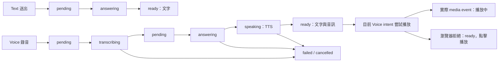

# Quality hardening 交付紀錄（2026-10-07）

A Voice、B 教材進度、C 概念卡已完成並依後續授權部署。D 已完成公開來源 PoC 與取捨報告，沒有新增 production browser；其中「direct 403、普通瀏覽器成功」的實際公開案例仍未觀察到，不能宣稱此項樣本驗證完成。

## 起始狀態與 Git

追加任務起始 branch `dev`，HEAD `8c984b87ddb0fe22a12ebaf112453e6e8a4f1f39`；本機 dev、origin/dev tracking 與只讀 remote 查詢一致，與 dev 差異 0/0。當時有 65 個 tracked 修改、9 個 untracked 檔，全部保留；不是乾淨 checkout。

起始 status、baseline diff 留在 `.studydy-runtime/quality-hardening-20261007/starting-state.json` 與 `baseline.patch`。A/B/C 依開始快照及各次部署快照分離成 `review/A-voice.patch`、`B-progress.patch`、`C-cards.patch`，分別 18／19／8 個檔；D 的開發工具與研究文件另為 `D-research.patch`。這些是可審查 patch；本紀錄初次交付時尚未 stage、commit、push、建立 branch／PR 或 merge，後續經授權的提交以 Git 歷史為準。沒有把 `docs_local/`、私密設定、教材或 DB 放入 patch。

## A：Text／Voice lifecycle

沿用既有 Voice worker、conversation、turn、引用與 provider；沒有第二套問答或 source truth。

- 新增 migration 18，turn 持久化 `mode=text|voice|null`。舊資料維持 NULL，不猜測、不回填；原有 legacy 行為保留。
- Text 直接取得教材文字回答並 ready，不排 TTS、不等待音訊。
- Voice 的 STT 結果自動接回答及 TTS，不再要求第二次送出。
- 僅目前 Voice intent 可自動嘗試播放；Text、reload、舊 turn、account／route change 不會觸發舊音訊。Voice 開啟時既有 Podcast 暫停行為保留。
- autoplay 被拒絕仍為 ready，以「語音回答已完成，點擊播放」正常提示保留文字／音訊，不顯示失敗紅框。只在真實 media event 顯示播放中。
- cancel／retry／late lease／舊 revision 仍受既有 owner 與綁定檢查；retry 使用後端實際回傳狀態，避免前端猜測造成競態。



失敗／取消保留可恢復資訊；retry 依現有 transcript／answer 從必要階段繼續。Text retry 不進 TTS；legacy NULL 的 draft／manual-send 相容性保留。播放狀態不是 backend turn 新狀態。

## B：真實 stage progress

新增 migration 19 的 nullable `completed_units`／`total_units`，舊記錄不捏造數字。

| backend stage | 使用者階段 | 分母 |
|---|---|---|
| queued | 等待資源 | 無；indeterminate |
| evidence | 整理來源 | 真實完成頁數／來源總頁數 |
| semantics | 語意分析 | 已處理 canonical Evidence blocks／本輪 blocks |
| review | 檢查／修正知識結構 | 已驗證完成 review units／當前 units |
| publishing | 組裝／發布 | 無可用分母時 indeterminate |
| terminal succeeded／partial | 完成 | 才可 overall 100；partial 不表示內容品質合格 |

介面顯示第 N/5 階段與本階段的 `floor(done/total*100)`；沒有分母便不顯示百分比，不猜 ETA。整體百分比在 nonterminal 為 NULL，移除長期 clamp 99。

semantic／review units 與 source page count 分開；failed review parent 不增加完成數，split 會改變分母並明示。stage 只能依序前進，略過 review 有明確既有設定；failure／cancel／recovery 保留最後真實 stage 與 units。前端拒絕 `updated_at` 較舊的讀取結果。

多來源預設收合為數量，展開後有限高度捲動。以 368 頁、49 review units、24 份來源的 fixture 驗證桌機／手機、reload、stale response、失敗／取消與發布狀態。

## C：Visual Concept Card

使用同一固定 revision 的 canonical KS／claims／relations／Evidence，沒有新資料模型、生成式影像或任意 SVG／JS。

- 每張前面有自含 React SVG 與少量來源文字；背面保留完整 claims、限制條件與 source buttons。
- prerequisite、part_of、application、example、contrast 使用固定模板及真實端點角色。prerequisite 不畫成時間流程；contrast 不補造優缺點。
- code／formula 從受支持 Evidence kind 的原始 claim literal 呈現，不自造演算法、公式或資料結構。
- 關聯證據不足或沒有受支持 process mapping，退回明示的裝飾 pictogram。`needs_review` 正反面都可見，不把它畫成已驗收。
- CardSetPage 取得卡組所固定的 revision，取消過期讀取並支援失敗重試；preview 使用原有 KS。保留 card-set identity／revision retention／source resolver／編輯刪除語意。

代表性圖位於 `.studydy-runtime/quality-hardening-20261007/C-evidence/`，各有 1280／390 寬：`general`、`prerequisite`、`contrast`、`part_of`、`application`、`example`、`code`、`formula`、`process-fallback`、`unresolved-evidence`。20 張已保存，代表畫面經檢查；測試另驗證 SVG 可獨立 decode、source click、完整文字與惡意字串 inert。未加入下載 SVG／PNG 的產品按鈕。

## D：取得研究

[完整 benchmark、重跑命令與官方文件依據](research-acquisition.md)。新增 `ops/research/` 開發工具，沿用現有 direct client 與 Playwright，沒有 production API／schema／容器變更。

| 方法 | 取得成功 | 本次正文資格 | 判讀 |
|---|---:|---:|---|
| A direct HTTP | 9/10 | 3/10 | 官方 HTML 可用，XML 尚未接入產品 |
| B 官方路徑／PoC parser | 6/6 適用樣本 | 3/10 | 其餘 4 個明示不適用；新增一份 CC BY XML |
| C 普通 Chromium | 9/10 | 3/10 | 可渲染 JS，但新增內容未確認再利用授權 |
| D metadata fallback | 10/10 保留 link | 0/10 全文 | 不送 canonical ingestion |

A+B 聯集為 4/10；C 沒有新增合格樣本。因此不加入 production Chromium，優先評估正式 JATS／OA 分發 path。十個固定樣本是負向與正向案例集合，不能當作一般產品通過率。

## 測試命令與結果

所有 pytest 使用 `PYTHONPATH=backend/src:backend/tests/runtime:backend/tests:local_ai/src` 與 `backend/.venv/bin/pytest -q`；runtime fixture 使用 disposable PostgreSQL，不接產品 DB。以下為追加工程驗證，未啟動 GPU／Pod／付費 inference。

| 項目 | pytest 路徑／範圍 | 結果 |
|---|---|---|
| A | `backend/tests/runtime/materials/{test_voice,test_podcast_interaction,test_evidence_json}.py` | 29 passed |
| B | `backend/tests/runtime/sources/{test_processing_cancellation,test_material_review_flow}.py`、`backend/tests/runtime/materials/test_material_discard.py`、`backend/tests/test_material_pipeline_v1.py` | 最終受影響組 59 passed |
| B | `backend/tests/{test_material_review,test_review_coverage_repair}.py` | 44 pure review passed |
| C | `backend/tests/runtime/materials/test_card_sets.py` | 12 passed |
| C | `backend/tests/runtime/materials/test_card_sets_browser.py` | 1 真 API browser passed，隔離 DB／受控模型 |
| D | `backend/tests/test_research_sources.py`、`backend/tests/runtime/materials/test_research.py` | 22＋11 passed |
| D | `ops/research/test_egress.py`、`ops/research/test_benchmark.py` | 9＋3 passed；含 metadata IP 拒絕、固定 pin、artifact write failure 不得算成功 |

前端共同命令：

```bash
npm --prefix frontend test
npm --prefix frontend run typecheck
npm --prefix frontend run build -- --outDir "$PWD/.studydy-runtime/quality-hardening-20261007/C-ui" --emptyOutDir
```

A/B/C 各次最後修改後均通過 Node 6 個測試檔、TypeScript 與 production build；六是檔數，不是個別 case 數。build 有既有 bundle-size advisory，未隱藏。

Mock browser 使用既有 runner，例如：

```bash
STUDYDY_E2E_FRONTEND_DIST="$PWD/.studydy-runtime/quality-hardening-20261007/C-ui" \
STUDYDY_E2E_FRONTEND_PORT=4196 STUDYDY_E2E_API_PORT=8196 \
PYTHONPATH=backend/tests/runtime backend/.venv/bin/python - <<'PY'
from browser_e2e_runner import main
raise SystemExit(main('e2e/mock/material-tools.spec.ts', timeout_seconds=300))
PY
```

各階段改成當次 A-ui／B-ui／C-ui 及對應 spec：

| 項目 | specs | 結果 |
|---|---|---|
| A | `voice-chat.spec.ts`、`material-tools-placement.spec.ts`、`material-tools.spec.ts` | 17＋7＋20 passed |
| B | `processing.spec.ts`、`processing-cancel.spec.ts`、`source-revisions.spec.ts` | 36 passed |
| C | `concept-cards.spec.ts` | 29 mock passed，另上列 1 真 API case |
| D | `material-tools.spec.ts` | 20 passed，沿用未再修改的 C build |

測試中發現的 retry autoplay 競態、blocked autoplay 錯誤色彩、舊 publishing guard、卡片舊 UI selector 與取消 read 的測試等待條件均已修正並重跑。D 初次 Docker／loopback 測試因 sandbox 權限失敗，授權執行環境下已通過。沒有把 skip 或環境失敗算成 pass。

## 部署及資料

A：`data/deployments/quality-voice-20261007T111856Z/manifest.json`。
B：`data/deployments/quality-progress-20261007T113051Z/manifest.json`。
C：`data/deployments/quality-cards-20261007T114510Z/manifest.json`。

A/B 更新 backend＋frontend，migration 到 19；驗證既有 Voice 與 processing rows 除新 nullable 欄位外 hash／count 不變。C 只更新 frontend，backend 未重啟、schema 仍 19。部署保留 DB 備份及 rollback images；備份／設定只留本機，不加入 Git。容器來源／資產 hash 與所驗證 build 核對，公開頁面完成控制項、實際教材進度與卡片預覽檢查，未為部署驗證送模型請求。

## 實際限制與未完成驗證

- 新 Voice lifecycle 的真 STT／TTS、實體麥克風、行動裝置 autoplay、人耳音質、跨瀏覽器驗證：NOT RUN。需要另行核准真 provider／裝置驗收，不能用 deterministic tests 宣稱完成。
- B/C 不改變原教材 `partial`／`needs_review` 的品質判定；卡片視覺不是內容正確性的背書。
- D 的 direct-403／browser-success 真實公開樣本：NOT OBSERVED，仍缺此情境驗證。沒有使用 synthetic fixture 假裝公開 coverage。
- Europe PMC JATS production ingestion 的內容完整性／來源定位，以及 OpenAlex metered content API，留待實際產品範圍與使用額度決策。本次不花額度、不新增 production adapter。
- A/B/C 與 D 的回歸均沒有額外 GPU／Pod 或付費模型呼叫；原長教材先前已授權的模型工作是另一段驗證，不混為本次品質證據。
